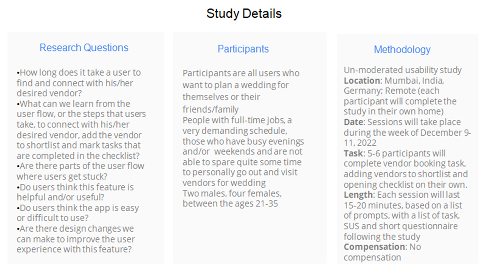
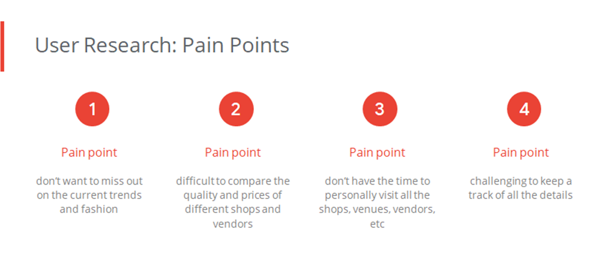

I undertook this project to help individuals who have a busy demanding schedule or are out of station or by some means are not able to spare times, to plan a dream wedding for themselves or their friends and family, without missing out on the current trends and fashion, and easy options to compare between different vendors online, through an app, since they do not have the time to personally visit all the shops, venues, vendors, etc.

> Project Duration: 8 weeks

### The Problem
Most of the individuals have a busy demanding schedule or are out of station or by some means are not able to spare time, to plan a dream wedding for themselves or their friends and family. I wanted to develop an app that is a one-stop-shop app which can help these individuals to plan the wedding without missing out on the current trends and fashion, and find easy options to compare between different vendors online through an app since they do not have the time to personally visit 
all the shops, venues, vendors, etc.

### The Goal
To figure out if the users are successfully able to plan their dream wedding without missing out on the current trends and fashion by allowing them to surf through, and easily compare between different venues and vendors, book/finalise the vendors and add tasks to checklists.

### My Role
Lead UX Designer, UX Researcher

### My Responsibilities as a UX Designer
User Research, Competitive Audit, Ideation, Wireframing, Prototyping (Lo-Fi + Hi-Fi)

* To design a ceremonial checklist app for trendy wedding
* Ideate and design app screens
* Test designs
* Ensure that the designs are interactive and provide a good user flow, user journey and a user experience
* Conduct test and research
*  Re-iterate on designs

{:width="600" height="300" loading="lazy"}

## Prototyping
You can find my prototypes if you visit [this link](https://www.behance.net/chiranjjoshi)

### Understanding The User : User research
#### User Research Summary
My research began with a series of inquiries directed at a variety of people in order to have a better understanding of their issues and demands in planning a wedding. The purpose of this study was to gain a better understanding of individuals and their needs, as well as to put them at the center of my design process, and product. I gathered information through one-on-one interviews in order to learn more about the people and the issues they confront. I conducted an unmoderated user reasearch with 5 participants on remote basis.
{:width="500" height="250" loading="lazy"}
{:width="500" height="250" loading="lazy"}
#### Persona 1: Ms. Aarushi Gore
Problem Statement : Ms. Aarushi Gore is a workaholic who needs to plan her dream wedding without missing out on the current trends and fashion, and needs easy options to compare between different vendors because she doesn’t have the time to personally visit all the shops, venues, vendors, etc. 
{:width="500" height="250" loading="lazy"}

## Inline HTML elements

HTML defines a long list of available inline tags, a complete list of which can be found on the [Mozilla Developer Network](https://developer.mozilla.org/en-US/docs/Web/HTML/Element).

- **To bold text**, use `**To bold text**`.
- *To italicize text*, use `*To italicize text*`.
- Abbreviations, like HTML should be defined like this `*[HTML]: HyperText Markup Language`.
- Citations, like <cite>&mdash; Mark otto</cite>, should use `<cite>`.
- ~~Deleted~~ text should use `~~deleted~~` and <ins>inserted</ins> text should use `<ins>`.
- Superscript text uses `` and subscript text uses ``.

Most of these elements are styled by browsers with few modifications on our part.

## Heading 2
Vivamus sagittis lacus vel augue rutrum faucibus dolor auctor. Duis mollis, est non commodo luctus, nisi erat porttitor ligula, eget lacinia odio sem nec elit. Morbi leo risus, porta ac consectetur ac, vestibulum at eros.

### Heading 3
Vivamus sagittis lacus vel augue rutrum faucibus dolor auctor.

#### Heading 4
Vivamus sagittis lacus vel augue rutrum faucibus dolor auctor.

##### Heading 5
Vivamus sagittis lacus vel augue rutrum faucibus dolor auctor.

###### Heading 6
Vivamus sagittis lacus vel augue rutrum faucibus dolor auctor.

## Code

Cum sociis natoque penatibus et magnis dis `code element` montes, nascetur ridiculus mus.

~~~js
// Example can be run directly in your JavaScript console

// Create a function that takes two arguments and returns the sum of those
// arguments
var adder = new Function("a", "b", "return a + b");

// Call the function
adder(2, 6);
// > 8
~~~

## Lists

Cum sociis natoque penatibus et magnis dis parturient montes, nascetur ridiculus mus. Aenean lacinia bibendum nulla sed consectetur. Etiam porta sem malesuada magna mollis euismod. Fusce dapibus, tellus ac cursus commodo, tortor mauris condimentum nibh, ut fermentum massa justo sit amet risus.

* Praesent commodo cursus magna, vel scelerisque nisl consectetur et.
* Donec id elit non mi porta gravida at eget metus.
* Nulla vitae elit libero, a pharetra augue.

Donec ullamcorper nulla non metus auctor fringilla. Nulla vitae elit libero, a pharetra augue.

1. Vestibulum id ligula porta felis euismod semper.
2. Cum sociis natoque penatibus et magnis dis parturient montes, nascetur ridiculus mus.
3. Maecenas sed diam eget risus varius blandit sit amet non magna.

Cras mattis consectetur purus sit amet fermentum. Sed posuere consectetur est at lobortis.

HyperText Markup Language (HTML)
: The language used to describe and define the content of a Web page

Cascading Style Sheets (CSS)
: Used to describe the appearance of Web content

JavaScript (JS)
: The programming language used to build advanced Web sites and applications

Integer posuere erat a ante venenatis dapibus posuere velit aliquet. Morbi leo risus, porta ac consectetur ac, vestibulum at eros. Nullam quis risus eget urna mollis ornare vel eu leo.

## Images

Quisque consequat sapien eget quam rhoncus, sit amet laoreet diam tempus. Aliquam aliquam metus erat, a pulvinar turpis suscipit at.

## Tables

Aenean lacinia bibendum nulla sed consectetur. Lorem ipsum dolor sit amet, consectetur adipiscing elit.

| Name     | Upvotes   | Downvotes |
|:---------|:----------|:----------|
| Alice    |        10 |        11 |
| Bob      |         4 |         3 |
| Charlie  |         7 |         9 |
|==========|===========|===========|
|Totals    |        21 |        23 |

Nullam id dolor id nibh ultricies vehicula ut id elit. Sed posuere consectetur est at lobortis. Nullam quis risus eget urna mollis ornare vel eu leo.

*[HTML]: HyperText Markup Language
*[CSS]: Cascading Style Sheets
*[JS]: JavaScript
