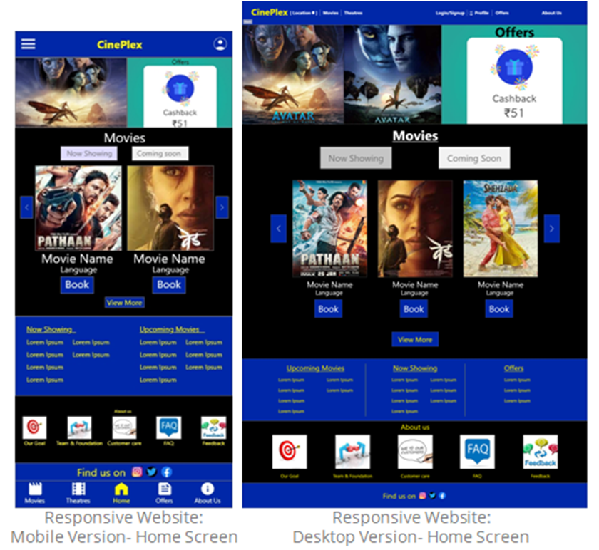
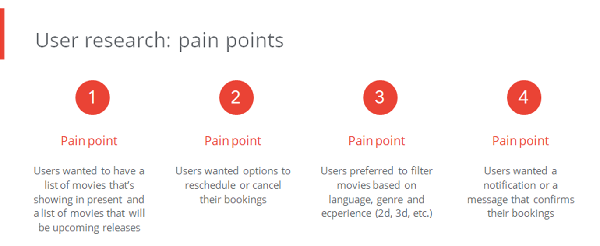
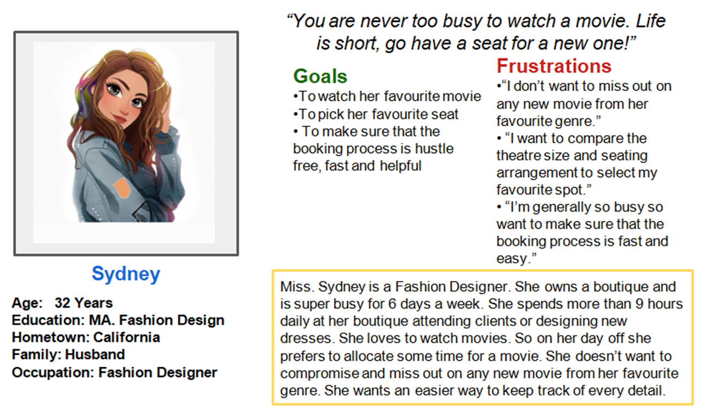
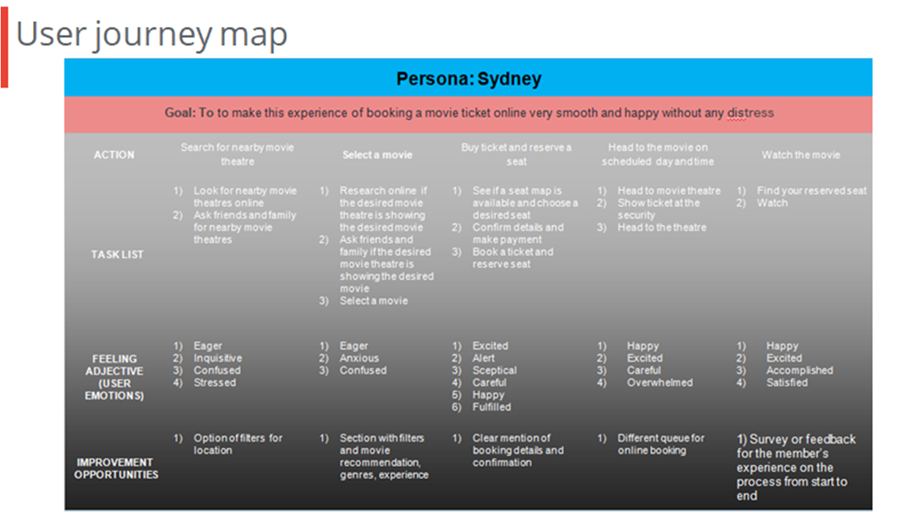
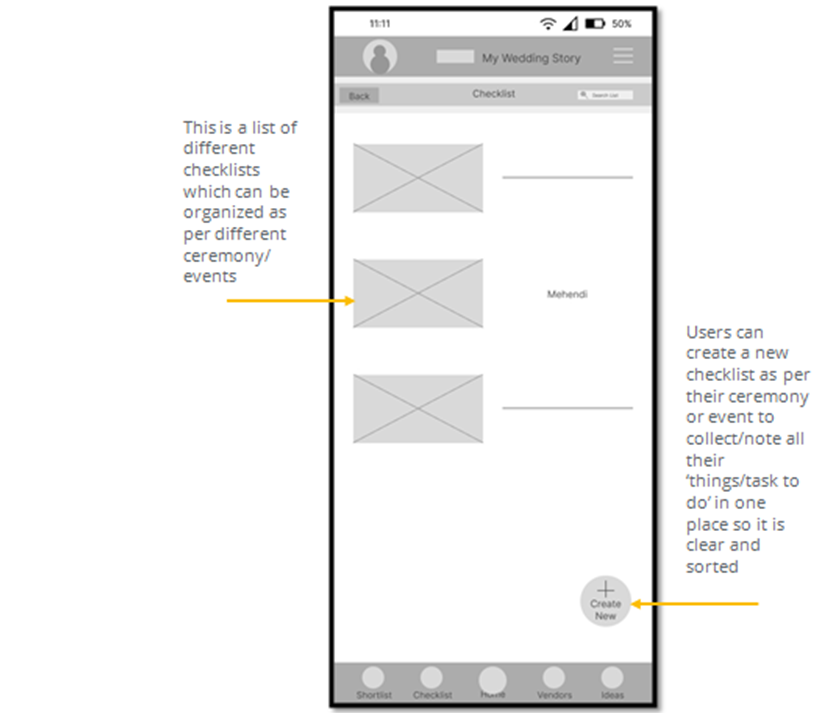
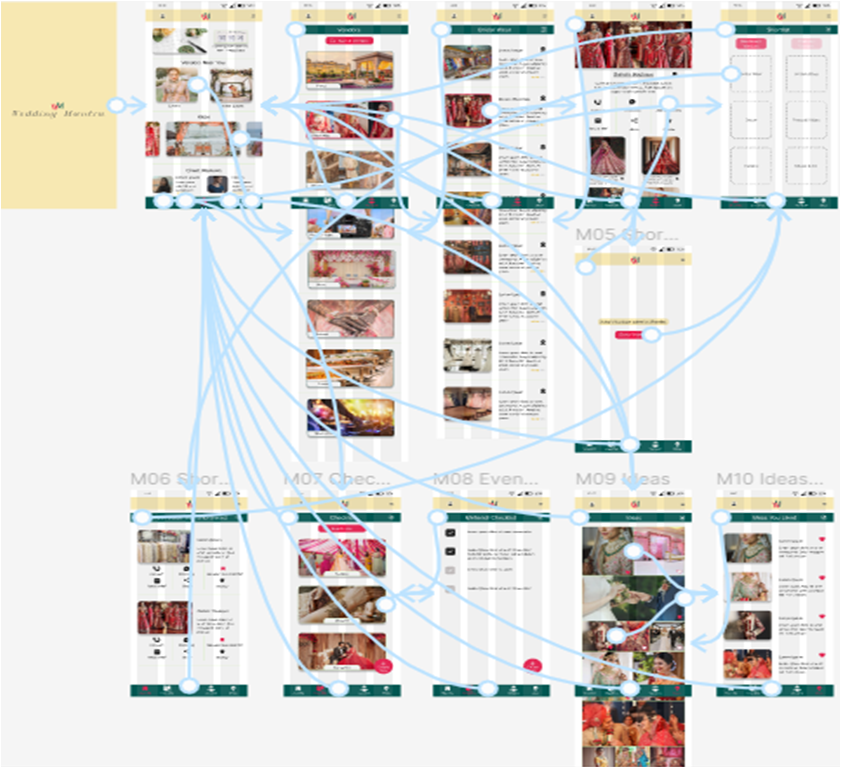
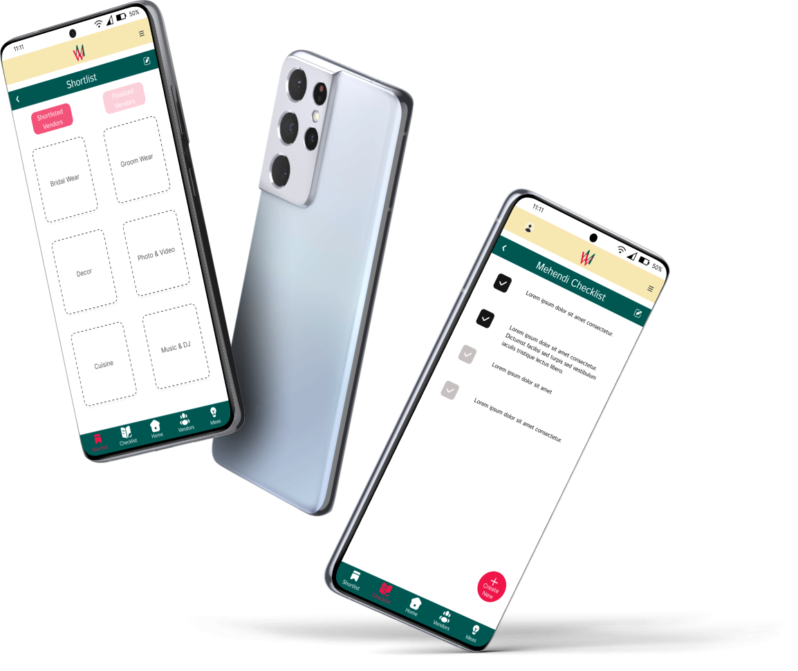

CinePlex is a movie ticket booking app and a responsive website. CinePlex helps to book tickets for a movie for you and your friends and family, fast, in more efficient manner and in a fun way! You can book seats in advance and also cancel or reschedule.

> Project Duration: 4 weeks

### The Problem
Busy workers lack the time to book themselves or their friends and family, the tickets to the movies.

### The Goal
Streamline the process of booking tickets to save as much time and energy as possible and without any hustle!

### My Role
Lead UX Designer, UX Researcher

### My Responsibilities as a UX Designer
**User Research, Competitive Audit, Ideation, Wireframing, Prototyping (Lo-Fi + Hi-Fi)**

* To design a seat reservation flow for a movie 
* Ideate and design app and website screens
* Test designs
* Ensure that the designs are interactive and provide a good user flow, user journey and a user experience
* Conduct test and research
* Re-iterate on designs

{:width="600" height="300" loading="lazy"}

### Understanding The User : User Research
#### User Research Summary
My research began with a series of inquiries directed at a variety of people in order to have a better understanding of their issues and demands in booking a seat for a movie. The purpose of this study was to gain a better understanding of individuals and their needs, as well as to put them at the center of my design process, and product. I gathered information through one-on-one interviews in order to learn more about the people and the issues they confront. I conducted an unmoderated user reasearch with 5 participants on remote basis.

{:width="500" height="250" loading="lazy"}

#### Persona : Sydney
Problem Statement : Sydney is a busy fashion designer who need to make sure that she can easily book her favourite seat for a movie online at anytime because she loves
to watch movies but is super busy for 6 days a week and spends more than 9 hours daily at her boutique attending clients or designing new dresses.
{:width="500" height="250" loading="lazy"}
{:width="500" height="250" loading="lazy"}

### The Design
#### Paper Wireframes
Taking the time to draft iterations of each screen of the app on paper ensured that the elements that made it to digital wireframes would be well-suited to address user pain points. 
{:width="700" height="350" loading="lazy"}
#### Digital Wireframes
As the initial design phase continued, I made sure to base screen designs on feedback and findings from  the user research.
{:width="500" height="250" loading="lazy"}
{:width="500" height="250" loading="lazy"}
#### Low-Fidelity Prototypes
Using the completed set of digital wireframes, I created a low-fidelity prototype. The primary user flow I connected was short listing a vendor from ‘bride’s wear’ category, so the prototype could be used in a usability study. I also added other user flows like browsing the checklist, shortlist and ideas section.
{:width="700" height="350" loading="lazy"}
##### Low-Fidelity Prototyping
You can find my low-fidelity prototypes if you visit [this link](https://www.figma.com/proto/WrajIBh2EEDSxPT4MHQvv3/My-Wedding-Story?node-id=105%3A82&scaling=scale-down&page-id=0%3A1&starting-point-node-id=105%3A40)
#### Usability Study Findings
**Connect Online Portals :** If one can connect online in this app and groups can be made with friends and family to directly share wishlist within the app itself.

### Refining The Design
People wanted to be able to share the wishlist/shortlist/favourites list with their friends and family groups online. This feature was not there before but haven been added after usability study.
{:width="500" height="250" loading="lazy"}
#### High-Fidelity Mockups and Prototypes
Using the completed set of low-fidelity prototypes, I created a high-fidelity mockup and prototype.
{:width="400" height="200" loading="lazy"}
#### Mockups
{:width="500" height="250" loading="lazy"}
{:width="500" height="250" loading="lazy"}
##### High-Fidelity Prototyping
You can find my high-fidelity prototypes if you visit [this link](https://www.figma.com/proto/WrajIBh2EEDSxPT4MHQvv3/My-Wedding-Story?page-id=713%3A2445&node-id=713%3A3679&viewport=412%2C150%2C0.06&scaling=scale-down&starting-point-node-id=713%3A3679)

{:width="500" height="250" loading="lazy"}

#### Going Forward
#### Takeaways
**Impact:** The feedback I have gotten from the final prototype is positive. My second usability study showed that the design of this app meets the user’s needs.

**One quote from peer feedback:** *“That’s a pretty good design and flow.”*
#### What I learned
In designing this project, I learned that user research plays an invaluable role in the UX process. Based on the influence of the user interviews, peer reviews and usability studies, I was able to iterate a comprehensive and inclusive design. 
#### Next Steps
{:width="600" height="300" loading="lazy"}

## Thank you for reviewing my work!
If you’d like to connect with me, here’s my email id : bite.mantra0206@gmail.com

## Inline HTML elements

HTML defines a long list of available inline tags, a complete list of which can be found on the [Mozilla Developer Network](https://developer.mozilla.org/en-US/docs/Web/HTML/Element).

- **To bold text**, use `**To bold text**`.
- *To italicize text*, use `*To italicize text*`.
- Abbreviations, like HTML should be defined like this `*[HTML]: HyperText Markup Language`.
- Citations, like <cite>&mdash; Mark otto</cite>, should use `<cite>`.
- ~~Deleted~~ text should use `~~deleted~~` and <ins>inserted</ins> text should use `<ins>`.
- Superscript text uses `` and subscript text uses ``.

Most of these elements are styled by browsers with few modifications on our part.

## Heading 2
Vivamus sagittis lacus vel augue rutrum faucibus dolor auctor. Duis mollis, est non commodo luctus, nisi erat porttitor ligula, eget lacinia odio sem nec elit. Morbi leo risus, porta ac consectetur ac, vestibulum at eros.

### Heading 3
Vivamus sagittis lacus vel augue rutrum faucibus dolor auctor.

#### Heading 4
Vivamus sagittis lacus vel augue rutrum faucibus dolor auctor.

##### Heading 5
Vivamus sagittis lacus vel augue rutrum faucibus dolor auctor.

###### Heading 6
Vivamus sagittis lacus vel augue rutrum faucibus dolor auctor.

## Code

Cum sociis natoque penatibus et magnis dis `code element` montes, nascetur ridiculus mus.

~~~js
// Example can be run directly in your JavaScript console

// Create a function that takes two arguments and returns the sum of those
// arguments
var adder = new Function("a", "b", "return a + b");

// Call the function
adder(2, 6);
// > 8
~~~

## Lists

Cum sociis natoque penatibus et magnis dis parturient montes, nascetur ridiculus mus. Aenean lacinia bibendum nulla sed consectetur. Etiam porta sem malesuada magna mollis euismod. Fusce dapibus, tellus ac cursus commodo, tortor mauris condimentum nibh, ut fermentum massa justo sit amet risus.

* Praesent commodo cursus magna, vel scelerisque nisl consectetur et.
* Donec id elit non mi porta gravida at eget metus.
* Nulla vitae elit libero, a pharetra augue.

Donec ullamcorper nulla non metus auctor fringilla. Nulla vitae elit libero, a pharetra augue.

1. Vestibulum id ligula porta felis euismod semper.
2. Cum sociis natoque penatibus et magnis dis parturient montes, nascetur ridiculus mus.
3. Maecenas sed diam eget risus varius blandit sit amet non magna.

Cras mattis consectetur purus sit amet fermentum. Sed posuere consectetur est at lobortis.

HyperText Markup Language (HTML)
: The language used to describe and define the content of a Web page

Cascading Style Sheets (CSS)
: Used to describe the appearance of Web content

JavaScript (JS)
: The programming language used to build advanced Web sites and applications

Integer posuere erat a ante venenatis dapibus posuere velit aliquet. Morbi leo risus, porta ac consectetur ac, vestibulum at eros. Nullam quis risus eget urna mollis ornare vel eu leo.

## Images

Quisque consequat sapien eget quam rhoncus, sit amet laoreet diam tempus. Aliquam aliquam metus erat, a pulvinar turpis suscipit at.

## Tables

Aenean lacinia bibendum nulla sed consectetur. Lorem ipsum dolor sit amet, consectetur adipiscing elit.

| Name     | Upvotes   | Downvotes |
|:---------|:----------|:----------|
| Alice    |        10 |        11 |
| Bob      |         4 |         3 |
| Charlie  |         7 |         9 |
|==========|===========|===========|
|Totals    |        21 |        23 |

Nullam id dolor id nibh ultricies vehicula ut id elit. Sed posuere consectetur est at lobortis. Nullam quis risus eget urna mollis ornare vel eu leo.

*[HTML]: HyperText Markup Language
*[CSS]: Cascading Style Sheets
*[JS]: JavaScript
