0. Line to be replaced
{:toc}

CinePlex is a movie ticket booking app and a responsive website. CinePlex helps to book tickets for a movie for you and your friends and family, fast, in more efficient manner and in a fun way! You can book seats in advance and also cancel or reschedule.

> Project Duration: 4 weeks

### The Problem
Busy workers lack the time to book themselves or their friends and family, the tickets to the movies.

### The Goal
Streamline the process of booking tickets to save as much time and energy as possible and without any hustle!

### My Role
Lead UX Designer, UX Researcher

### My Responsibilities as a UX Designer
**User Research, Competitive Audit, Ideation, Wireframing, Prototyping (Lo-Fi + Hi-Fi)**

* To design a seat reservation flow for a movie 
* Ideate and design app and website screens
* Test designs
* Ensure that the designs are interactive and provide a good user flow, user journey and a user experience
* Conduct test and research
* Re-iterate on designs

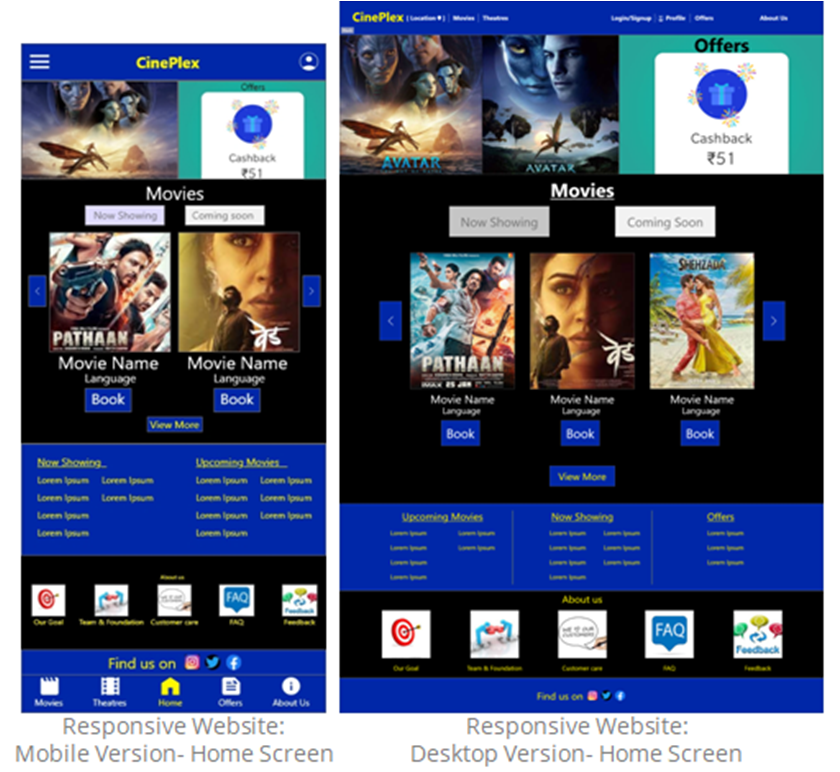{:width="600" height="300" loading="lazy"}

### Understanding The User : User Research
#### User Research Summary
My research began with a series of inquiries directed at a variety of people in order to have a better understanding of their issues and demands in booking a seat for a movie. The purpose of this study was to gain a better understanding of individuals and their needs, as well as to put them at the center of my design process, and product. I gathered information through one-on-one interviews in order to learn more about the people and the issues they confront. I conducted an unmoderated user reasearch with 5 participants on remote basis.

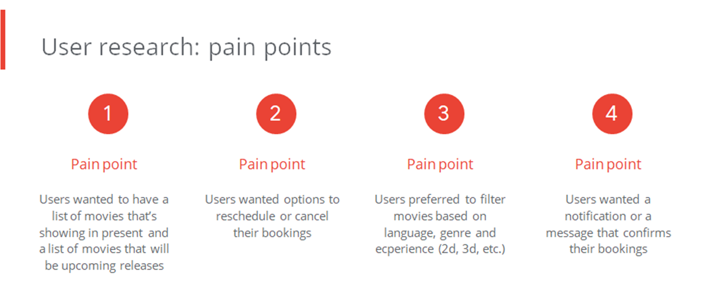{:width="500" height="250" loading="lazy"}

#### Persona : Sydney
Problem Statement : Sydney is a busy fashion designer who need to make sure that she can easily book her favourite seat for a movie online at anytime because she loves
to watch movies but is super busy for 6 days a week and spends more than 9 hours daily at her boutique attending clients or designing new dresses.
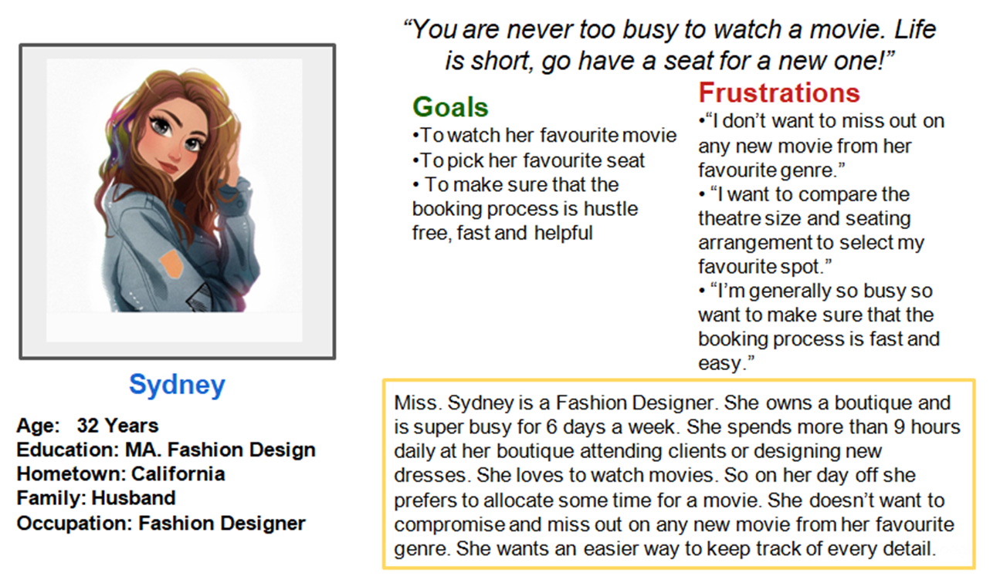{:width="500" height="250" loading="lazy"}
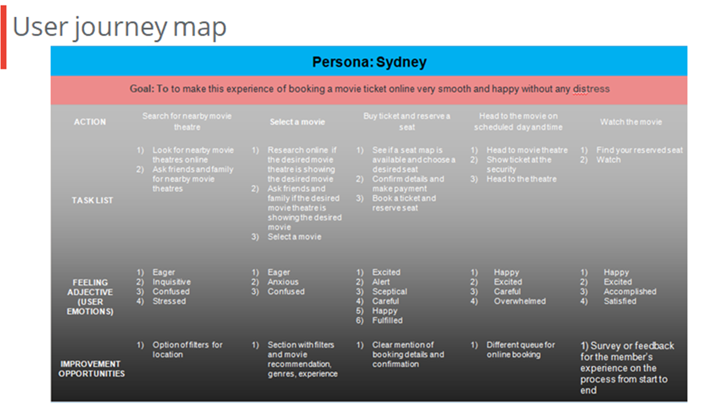{:width="500" height="250" loading="lazy"}

### The Design
#### Sitemap
Sitemap is a diagram of a website or application, that shows how pages are prioritized, linked, and labeled. It helps to understand how to access any useful information quickly and easily. During the construction of this sitemap, the results of the user testing were implemented for easy user flow. I also limited the level of details to minimum to avoid confusion and complexity. The main goal was to make sure that each area has all the necessary information for a user to operate this product.
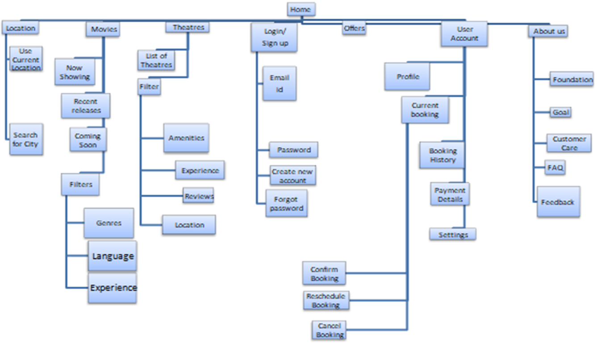{:width="500" height="250" loading="lazy"}

#### Paper Wireframes
Taking the time to draft iterations of each screen of the app on paper ensured that the elements that made it to digital wireframes would be well-suited to address user pain points. 
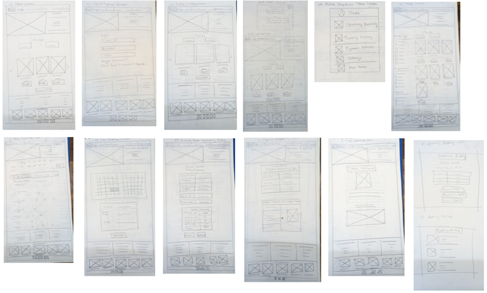{:width="600" height="300" loading="lazy"}
#### Digital Wireframes
As the initial design phase continued, I made sure to base screen designs on feedback and findings from  the user research.
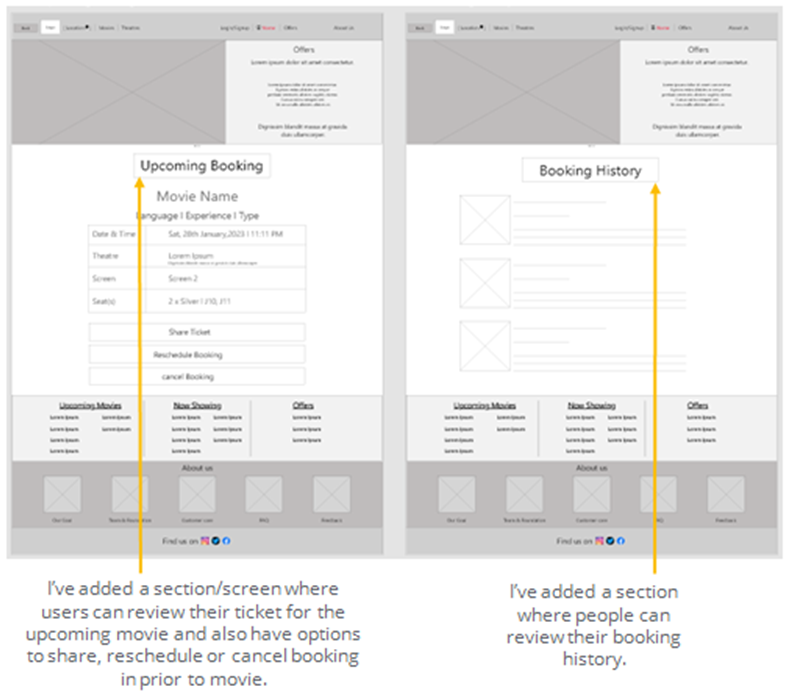{:width="500" height="250" loading="lazy"}
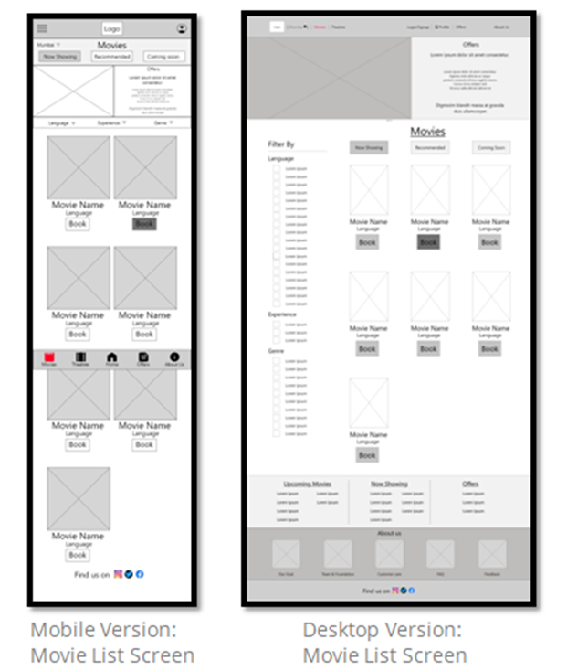{:width="500" height="250" loading="lazy"}
#### Low-Fidelity Prototypes
Using the completed set of digital wireframes, I created a low-fidelity prototype. The primary user flow I connected was right from loggin in to a user account to searching and setting loaction for easy theatre search to booking the ticket successfully.
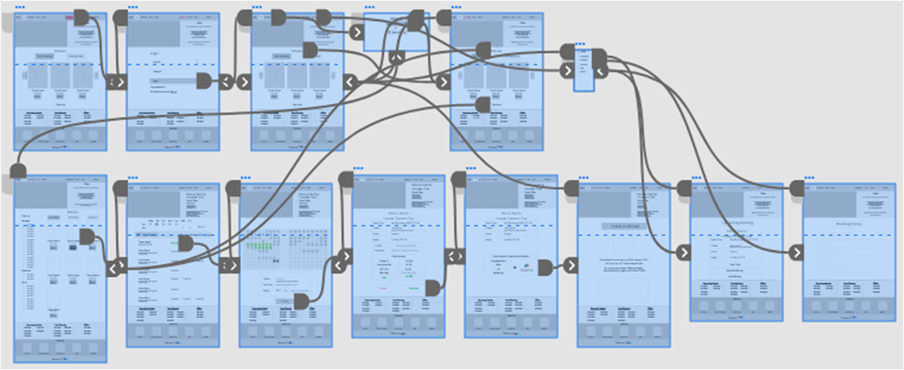{:width="700" height="350" loading="lazy"}
##### Low-Fidelity Prototyping
You can find my low-fidelity prototypes if you visit [this link](https://xd.adobe.com/view/002b3d7b-019c-41c8-aa6a-2443ab2a8a6d-5578/screen/06a8b176-7981-4f82-ae47-1436f85d71b7?fullscreen)
#### Usability Study Parameters
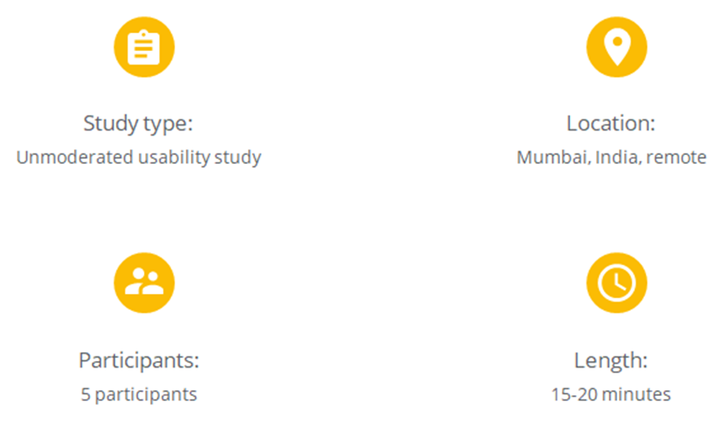{:width="500" height="250" loading="lazy"}
#### Usability Study Findings
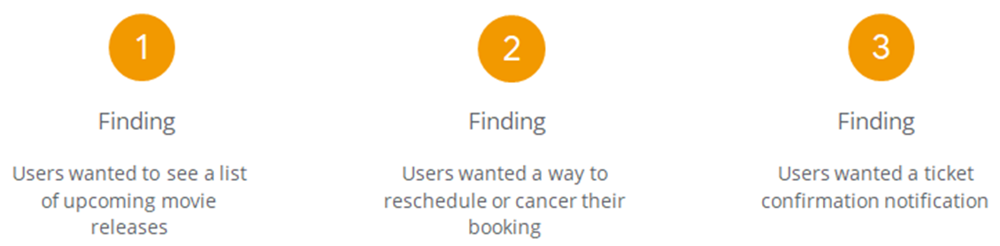{:width="500" height="250" loading="lazy"}

### Refining The Design
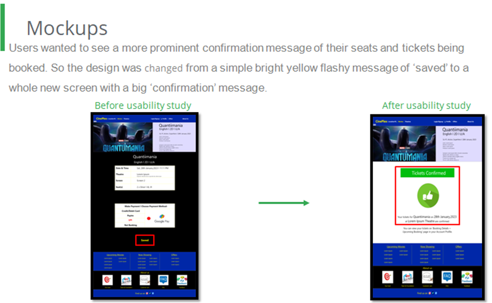{:width="500" height="250" loading="lazy"}

#### High-Fidelity Mockups and Prototypes
Using the completed set of low-fidelity prototypes, I created a high-fidelity mockup and prototype.
{:width="400" height="200" loading="lazy"}
#### Mockups (Original Screen Size)
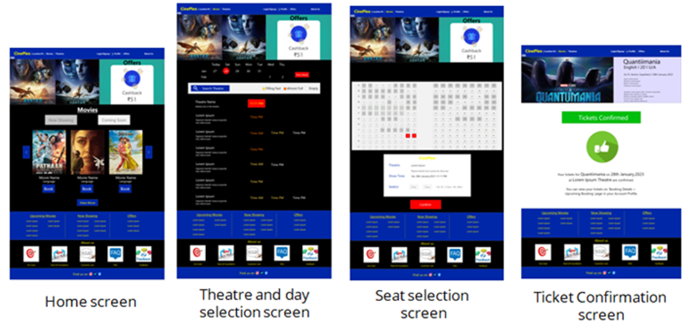{:width="700" height="350" loading="lazy"}

##### High-Fidelity Prototyping
You can find my high-fidelity prototypes if you visit [this link](https://xd.adobe.com/view/abd51dc7-1adf-429e-9174-79616b984f95-fe86/?fullscreen)

{:width="500" height="250" loading="lazy"}

#### Going Forward
#### Takeaways
**Impact:** The feedback I have gotten from the final prototype is positive. My second usability study showed that the design of this app meets the user’s needs.

**One quote from peer feedback:** *“Looks good for a high-fi. Keep up the good work!.”*
#### What I learned
In designing this project, I learned that user research plays an invaluable role in the UX process. Based on the influence of the user interviews, peer reviews and usability studies, I was able to iterate a comprehensive and inclusive design. 
#### Next Steps
{:width="600" height="300" loading="lazy"}
