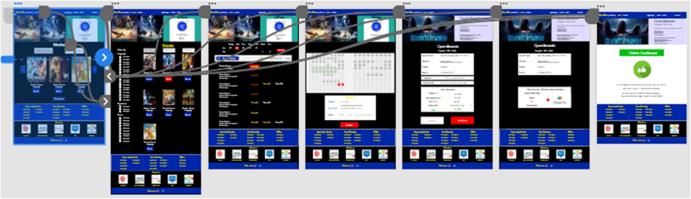
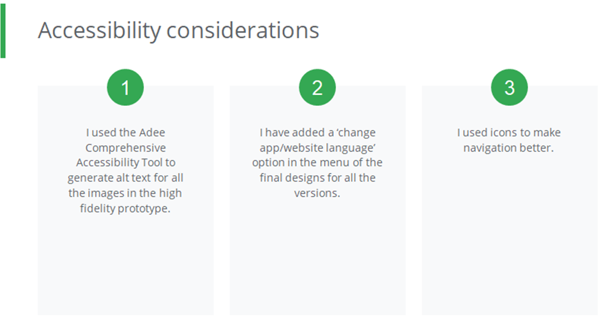

0. Line to be replaced
{:toc}

CinePlex is a Website where you can purchase Movie Tickets. It facilitates quick and efficient booking for you, your friends, and your family, making the process more enjoyable. You can also reserve seats in advance and make changes to your booking, such as ‘Canceling’ or ‘Rescheduling’.

> Project Duration: January 2023 to February 2023

{:width="600" height="300" loading="lazy"}

## Project Overview
### My Role
Lead UX Designer, UX Researcher
### My Responsibilities as a UX Designer
**User Research, Competitive Audit, Ideation, Wireframing, Prototyping (Lo-Fi + Hi-Fi)**
* To design a seat reservation flow for a movie 
* Ideate and design app and website screens
* Test designs
* Ensure that the designs are interactive and provide a good user flow, user journey and a user experience
* Conduct test and research
* Re-iterate on designs
### The Problem
Busy workers lack the time to book themselves or their friends and family, the tickets to the movies.
### The Goal
Streamline the process of booking tickets to save as much time and energy as possible and without any hustle!
### Tools Used
{:width="600" height="300" loading="lazy"}

## Design Process
I followed the ‘Design Thinking Framework’ for this project. The Design Thinking Framework is a User-centered approach to ‘problem-solving’ that includes activities like Research, Prototyping and Testing to help understand who the ‘User’ is, what their problems are, and what the design should include.
{:width="800" height="400" loading="lazy"}

## Understanding The User
### User Research 
* I initiated my research by posing a series of questions to diverse individuals to comprehend their challenges and requirements when reserving a movie seat. The objective of this investigation was twofold: to obtain a deeper comprehension of people and their necessities and to prioritize them in my design approach and final product.

* I gathered information through one-on-one interviews in order to learn more about the people and the issues they confront. 

* Through my research, I identified the user group as all individuals who don’t have time to personally visit movie theatres to book movie tickets or are busy and want to book tickets quickly without any hustle.

* I conducted an unmoderated user reasearch with 5 participants on remote basis.

### User Painpoints
{:width="500" height="250" loading="lazy"}

### Persona
Based on my analysis from the research I carried out, I was able to identify two personas 
that represent a diverse group of users. Also, I was able to comprehend what their
frustrations are and what their needs might be.
{:width="1000" height="750" loading="lazy"}

### The Design
#### Sitemap
Sitemap is a diagram of a website or application, that shows how pages are prioritized, linked, and labeled. It helps to understand how to access any useful information quickly and easily. During the construction of this sitemap, the results of the user testing were implemented for easy user flow. I also limited the level of details to minimum to avoid confusion and complexity. The main goal was to make sure that each area has all the necessary information for a user to operate this product.
{:width="500" height="250" loading="lazy"}

#### Paper Wireframes
Taking the time to draft iterations of each screen of the app on paper ensured that the elements that made it to digital wireframes would be well-suited to address user pain points. 
{:width="600" height="300" loading="lazy"}
#### Digital Wireframes
As the initial design phase continued, I made sure to base screen designs on feedback and findings from  the user research.
{:width="500" height="250" loading="lazy"}
{:width="500" height="250" loading="lazy"}
#### Low-Fidelity Prototypes
Using the completed set of digital wireframes, I created a low-fidelity prototype. The primary user flow I connected was right from loggin in to a user account to searching and setting loaction for easy theatre search to booking the ticket successfully.
{:width="700" height="350" loading="lazy"}
##### Low-Fidelity Prototyping
You can find my low-fidelity prototypes if you visit [this link](https://xd.adobe.com/view/002b3d7b-019c-41c8-aa6a-2443ab2a8a6d-5578/screen/06a8b176-7981-4f82-ae47-1436f85d71b7?fullscreen)
#### Usability Study Parameters
{:width="500" height="250" loading="lazy"}
#### Usability Study Findings
{:width="500" height="250" loading="lazy"}

### Refining The Design
{:width="500" height="250" loading="lazy"}

#### High-Fidelity Mockups and Prototypes
Using the completed set of low-fidelity prototypes, I created a high-fidelity mockup and prototype.
{:width="400" height="200" loading="lazy"}
#### Mockups (Original Screen Size)
{:width="700" height="350" loading="lazy"}

##### High-Fidelity Prototyping
You can find my high-fidelity prototypes if you visit [this link](https://xd.adobe.com/view/abd51dc7-1adf-429e-9174-79616b984f95-fe86/?fullscreen)

{:width="500" height="250" loading="lazy"}

#### Going Forward
#### Takeaways
**Impact:** The feedback I have gotten from the final prototype is positive. My second usability study showed that the design of this app meets the user’s needs.

**One quote from peer feedback:** *“Looks good for a high-fi. Keep up the good work!.”*
#### What I learned
In designing this project, I learned that user research plays an invaluable role in the UX process. Based on the influence of the user interviews, peer reviews and usability studies, I was able to iterate a comprehensive and inclusive design. 
#### Next Steps
{:width="600" height="300" loading="lazy"}
