0. Line to be replace by toc
{:toc}

I undertook this project to help individuals who have a busy demanding schedule or are out of station or by some means are not able to spare times, to plan a dream wedding for themselves or their friends and family, without missing out on the current trends and fashion, and easy options to compare between different vendors online, through an app, since they do not have the time to personally visit all the shops, venues, vendors, etc.

> Project Duration: 8 weeks

### The Problem
Most of the individuals have a busy demanding schedule or are out of station or by some means are not able to spare time, to plan a dream wedding for themselves or their friends and family. I wanted to develop an app that is a one-stop-shop app which can help these individuals to plan the wedding without missing out on the current trends and fashion, and find easy options to compare between different vendors online through an app since they do not have the time to personally visit 
all the shops, venues, vendors, etc.

### The Goal
To figure out if the users are successfully able to plan their dream wedding without missing out on the current trends and fashion by allowing them to surf through, and easily compare between different venues and vendors, book/finalise the vendors and add tasks to checklists.

### My Role
Lead UX Designer, UX Researcher

### My Responsibilities as a UX Designer
**User Research, Competitive Audit, Ideation, Wireframing, Prototyping (Lo-Fi + Hi-Fi)**

* To design a ceremonial checklist app for trendy wedding
* Ideate and design app screens
* Test designs
* Ensure that the designs are interactive and provide a good user flow, user journey and a user experience
* Conduct test and research
*  Re-iterate on designs

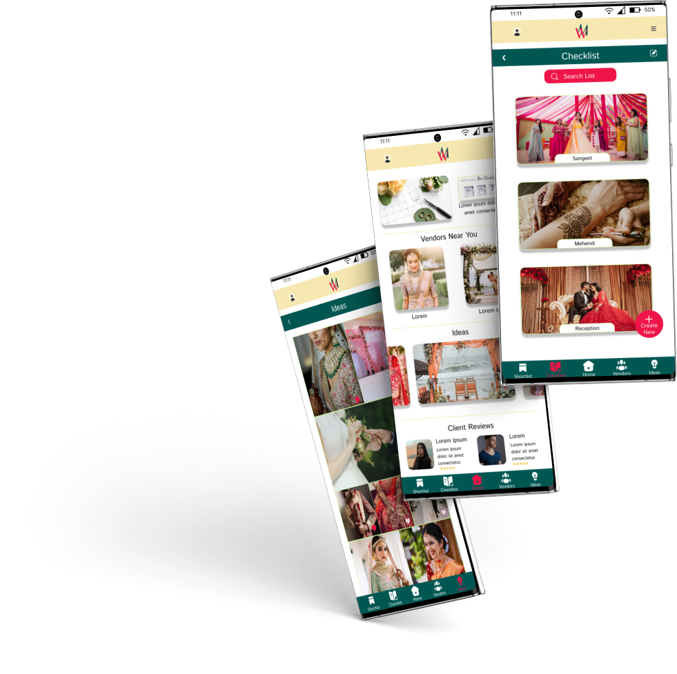{:width="600" height="300" loading="lazy"}

### Understanding The User : User Research
#### User Research Summary
My research began with a series of inquiries directed at a variety of people in order to have a better understanding of their issues and demands in planning a wedding. The purpose of this study was to gain a better understanding of individuals and their needs, as well as to put them at the center of my design process, and product. I gathered information through one-on-one interviews in order to learn more about the people and the issues they confront. I conducted an unmoderated user reasearch with 5 participants on remote basis.
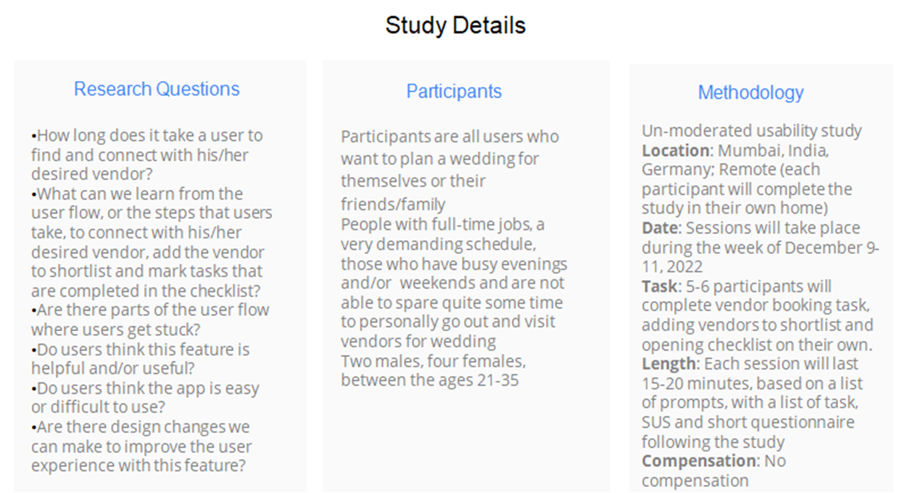{:width="500" height="250" loading="lazy"}
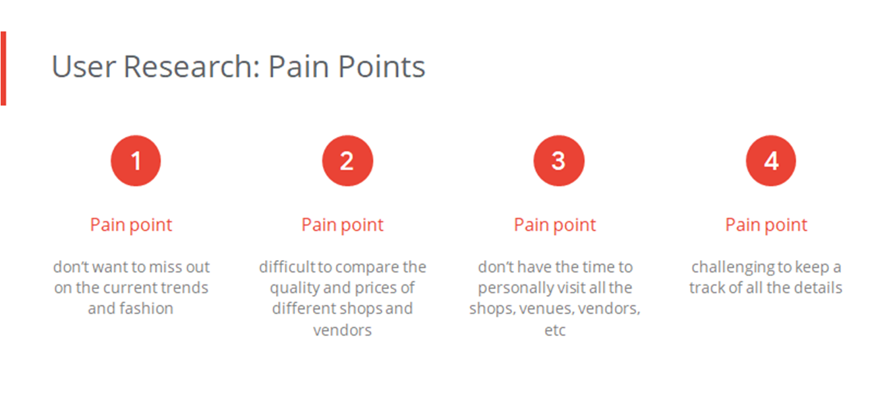{:width="500" height="250" loading="lazy"}
#### Persona 1: Ms. Aarushi Gore
Problem Statement : Ms. Aarushi Gore is a workaholic who needs to plan her dream wedding without missing out on the current trends and fashion, and needs easy options to compare between different vendors because she doesn’t have the time to personally visit all the shops, venues, vendors, etc. 
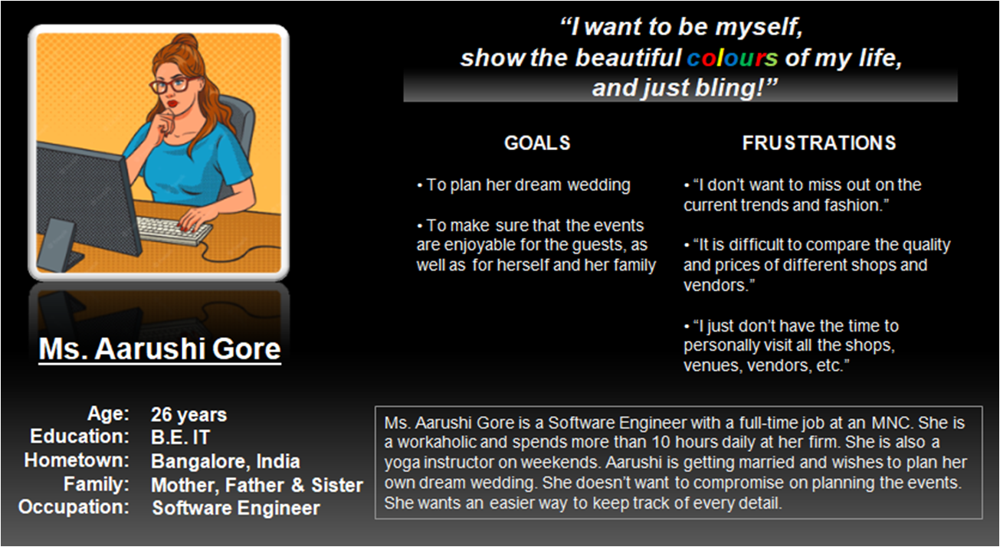{:width="500" height="250" loading="lazy"}
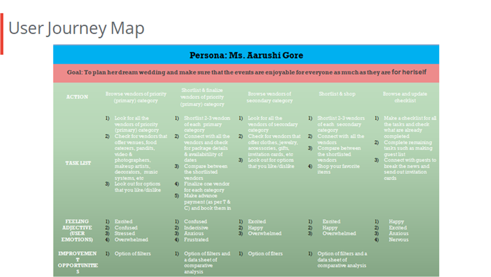{:width="500" height="250" loading="lazy"}

### The Design
#### Paper Wireframes
Taking the time to draft iterations of each screen of the app on paper ensured that the elements that made it to digital wireframes would be well-suited to address user pain points. 
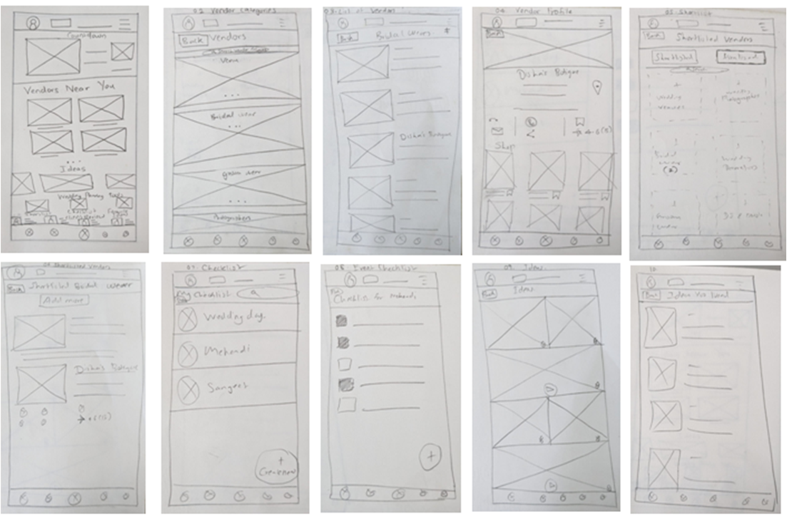{:width="700" height="350" loading="lazy"}
#### Digital Wireframes
As the initial design phase continued, I made sure to base screen designs on feedback and findings from  the user research.
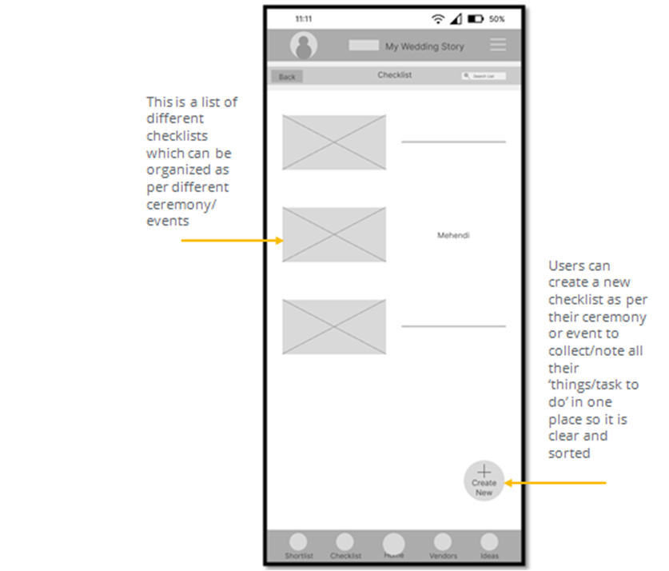{:width="500" height="250" loading="lazy"}
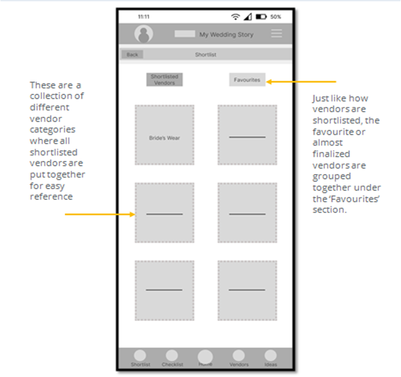{:width="500" height="250" loading="lazy"}
#### Low-Fidelity Prototypes
Using the completed set of digital wireframes, I created a low-fidelity prototype. The primary user flow I connected was short listing a vendor from ‘bride’s wear’ category, so the prototype could be used in a usability study. I also added other user flows like browsing the checklist, shortlist and ideas section.
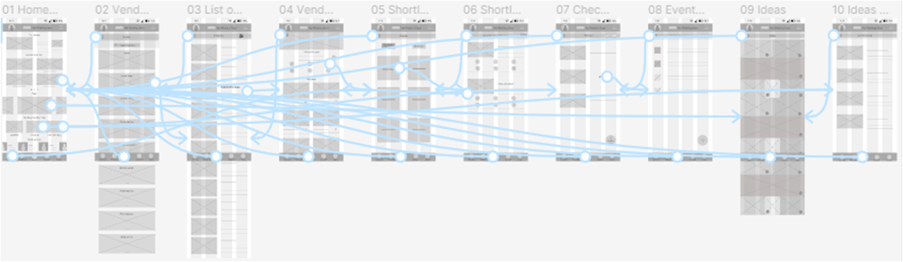{:width="700" height="350" loading="lazy"}
##### Low-Fidelity Prototyping
You can find my low-fidelity prototypes if you visit [this link](https://www.figma.com/proto/WrajIBh2EEDSxPT4MHQvv3/My-Wedding-Story?node-id=105%3A82&scaling=scale-down&page-id=0%3A1&starting-point-node-id=105%3A40)
#### Usability Study Findings
**Connect Online Portals :** If one can connect online in this app and groups can be made with friends and family to directly share wishlist within the app itself.

### Refining The Design
People wanted to be able to share the wishlist/shortlist/favourites list with their friends and family groups online. This feature was not there before but haven been added after usability study.
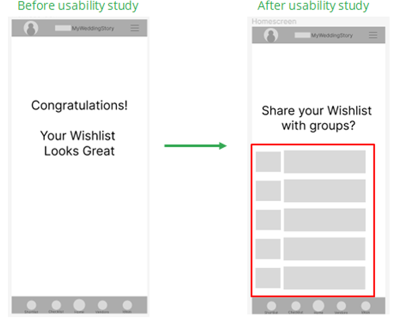{:width="500" height="250" loading="lazy"}
#### High-Fidelity Mockups and Prototypes
Using the completed set of low-fidelity prototypes, I created a high-fidelity mockup and prototype.
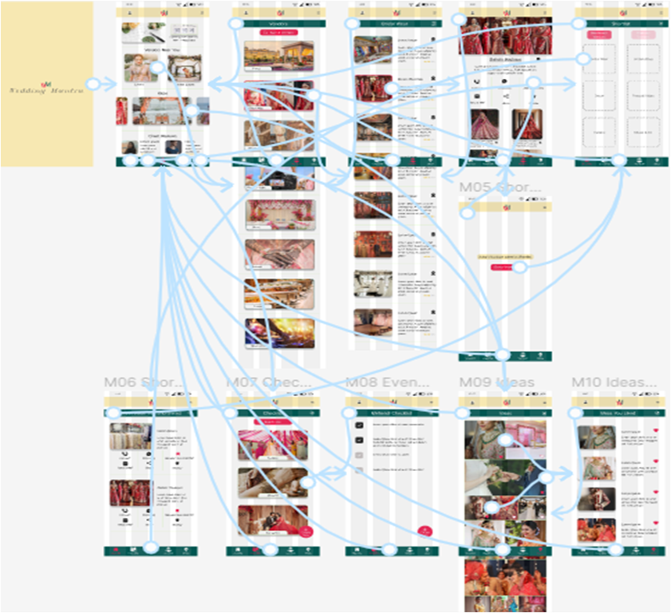{:width="400" height="200" loading="lazy"}
#### Mockups
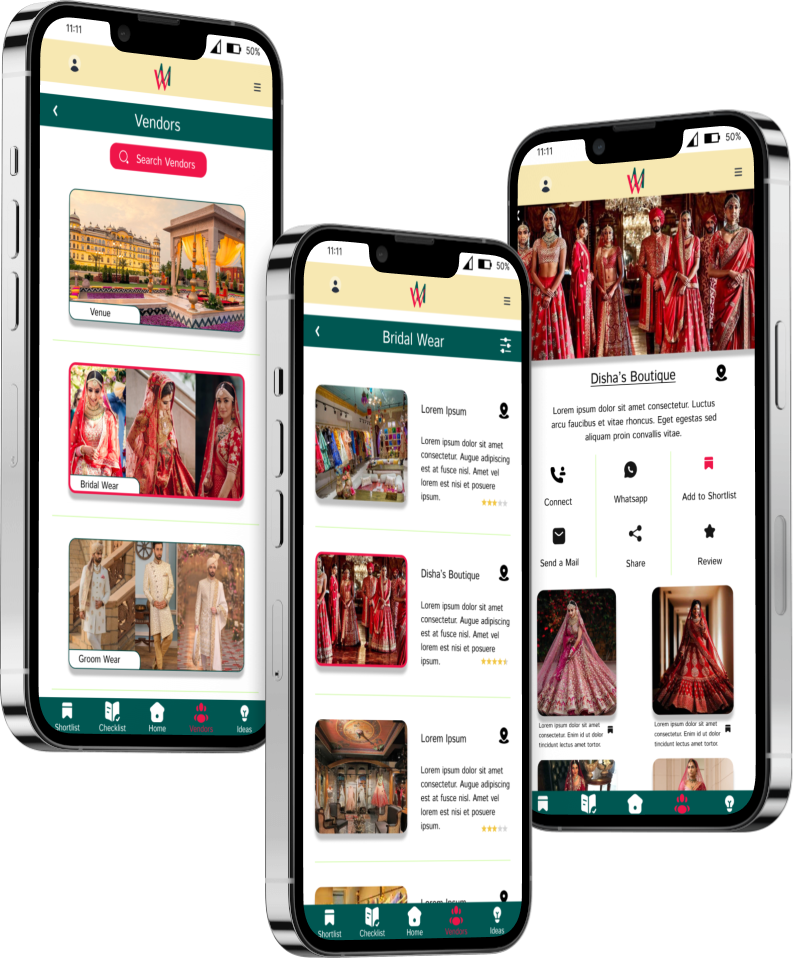{:width="500" height="250" loading="lazy"}
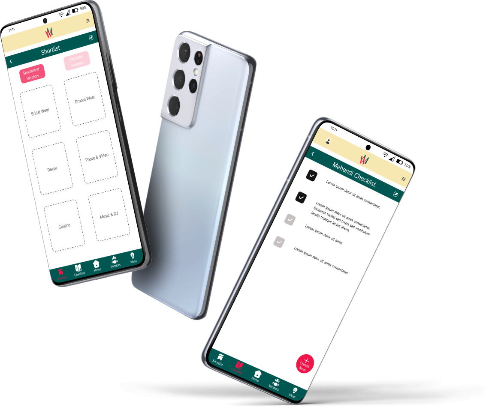{:width="500" height="250" loading="lazy"}
##### High-Fidelity Prototyping
You can find my high-fidelity prototypes if you visit [this link](https://www.figma.com/proto/WrajIBh2EEDSxPT4MHQvv3/My-Wedding-Story?page-id=713%3A2445&node-id=713%3A3679&viewport=412%2C150%2C0.06&scaling=scale-down&starting-point-node-id=713%3A3679)

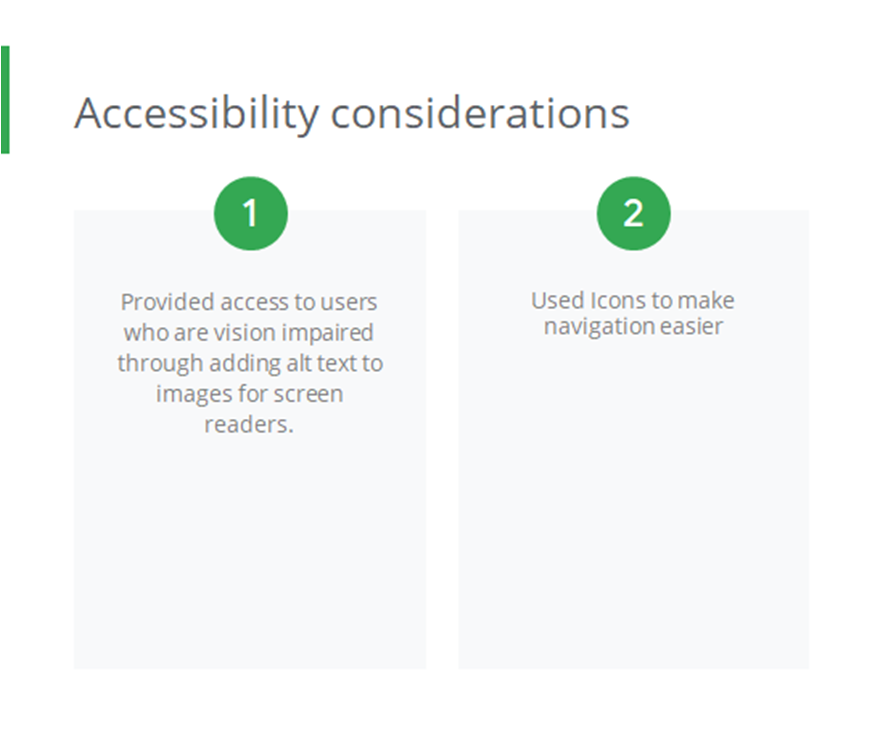{:width="500" height="250" loading="lazy"}

#### Going Forward
#### Takeaways
**Impact:** The feedback I have gotten from the final prototype is positive. My second usability study showed that the design of this app meets the user’s needs.

**One quote from peer feedback:** *“That’s a pretty good design and flow.”*
#### What I learned
In designing this project, I learned that user research plays an invaluable role in the UX process. Based on the influence of the user interviews, peer reviews and usability studies, I was able to iterate a comprehensive and inclusive design. 
#### Next Steps
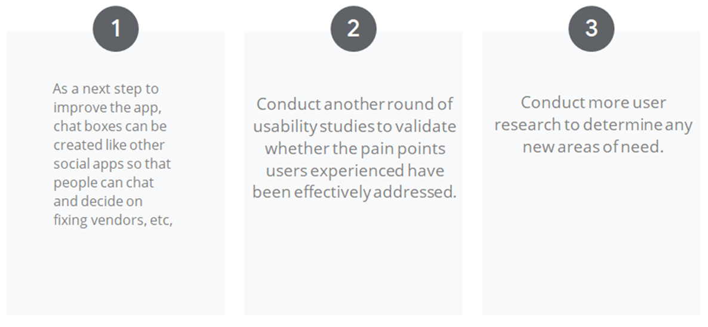{:width="600" height="300" loading="lazy"}
